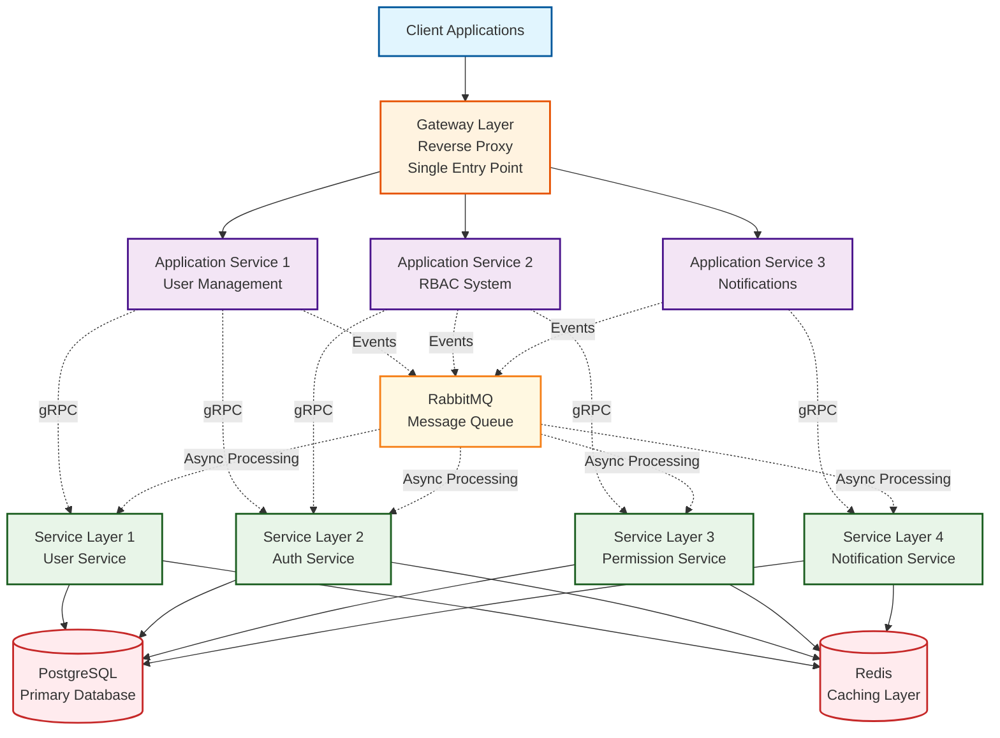

# Microservices Backend

## Introduction

This project demonstrates the implementation of a microservices-based backend application written primarily in Go. The architecture is designed with generic concepts in mind, including basic user management, Role-Based Access Control (RBAC) systems, notification systems, and more.

## Architecture Overview

The system is built using an event-driven architecture with a layered approach. The backend is structured into three primary layers, each serving distinct purposes:

### Gateway Layer
The Gateway serves as a reverse proxy that routes client requests to appropriate services. This design minimizes the number of ports that need to be configured for client applications. Clients can interact with a single endpoint, while the gateway handles API routing internally. This approach also reduces the complexity of nginx configurations required for deployment.

### Application Service Layer
This layer contains services whose logic is primarily driven by client requirements. It acts as the main orchestrator within the system. Typically, this layer does not have direct database access; instead, it relies on the underlying Service Layer for data operations. These are full-fledged Go applications that serve as the external-facing interface. The routes in this layer are designed for external system interactions and include middleware, authentication mechanisms, and other client-facing concerns. The underlying Service Layer remains isolated from direct external access.

### Service Layer
This layer houses pure, reusable services that are not bound to specific client logic. These services are not exposed directly to external clients. The Application Service Layer primarily communicates with this layer. The communication protocol used is gRPC. This layer has direct database access and contains the queries and connection logic for database interactions.

## Technology Stack

The service primarily relies on Go, with the following supporting technologies:

### Caching
- **Redis**: For distributed caching and session management

### Message Queues
- **RabbitMQ**: For asynchronous message processing and event distribution

### Database
- **PostgreSQL**: Primary relational database for data persistence

## Inter-Service Communication

The system implements two types of inter-service communication patterns:

### Synchronous Communication
- **Protocol**: gRPC
- **Use Case**: Direct service-to-service calls requiring immediate responses

### Asynchronous Communication
- **Protocol**: Message queues and events
- **Use Case**: Event-driven processing, background tasks, and decoupled service interactions

## Architecture Diagram




## Project Structure

The project is organized into distinct layers that reflect the microservices architecture. The `gateway` folder contains the gateway Go application, `apps` houses the application service layer applications, `services` contains the service layer applications, and `pkgs` provides reusable code and libraries. This structure follows the DRY (Don't Repeat Yourself) principle by centralizing common functionality.

### Root Directory Structure
```
Microservices/
├── gateway/               # Gateway layer application
├── apps/                  # Application service layer applications
├── services/              # Service layer applications
├── pkgs/                  # Reusable packages and libraries
└── docs/                  # Documentation and diagrams
```

### Gateway Layer
```
gateway/
├── main.go                 # Application entry point
├── config/                 # Configuration management
├── middleware/             # Gateway-specific middleware
├── routing/                # Route definitions and handlers
├── health/                 # Health check endpoints
└── utils/                  # Gateway utilities
```

### Application Service Layer
```
apps/
├── user-management/        # User management application service
│   ├── main.go
│   ├── handlers/           # HTTP handlers
│   ├── middleware/         # Auth, logging, validation
│   ├── models/             # Request/response models
│   ├── services/           # Business logic orchestration
│   ├── cache/              # Caching layer
│   └── config/
├── rbac-system/           # RBAC application service
│   ├── main.go
│   ├── handlers/
│   ├── middleware/
│   ├── models/
│   ├── services/
│   ├── cache/              # Caching layer
│   └── config/
└── notifications/         # Notification application service
    ├── main.go
    ├── handlers/
    ├── middleware/
    ├── models/
    ├── services/
    ├── cache/              # Caching layer
    └── config/
```

### Service Layer
```
services/
├── user-service/          # User management core service
│   ├── main.go
│   ├── proto/             # gRPC protocol definitions
│   ├── handlers/          # gRPC service implementations
│   ├── models/            # Data models and entities
│   ├── repository/        # Database access layer
│   ├── business/          # Core business logic
│   ├── cache/             # Caching layer
│   └── config/
├── auth-service/          # Authentication core service
├── permission-service/    # Permission management service
└── notification-service/  # Notification core service
```

### Shared Packages (`pkgs`)
```
pkgs/
├── middleware/            # Reusable middleware components
│   ├── auth/              # Authentication middleware
│   ├── logging/           # Logging middleware
│   ├── validation/        # Request validation middleware
│   └── cors/              # CORS handling middleware
├── database/              # Database connection and utilities
│   ├── postgres/          # PostgreSQL connection logic
│   ├── redis/             # Redis connection logic
│   └── migrations/        # Database migration utilities
├── grpc/                  # gRPC utilities and helpers
│   ├── client/            # gRPC client utilities
│   ├── server/            # gRPC server utilities
│   └── interceptors/      # gRPC interceptors
├── messaging/             # Message queue utilities
│   ├── rabbitmq/          # RabbitMQ connection and helpers
│   └── events/            # Event definitions and handlers
├── utils/                 # Common utilities
│   ├── config/            # Configuration utilities
│   ├── logger/            # Logging utilities
│   ├── errors/            # Error handling utilities
│   └── validators/        # Validation utilities
└── models/                # Shared data models
    └── common/            # Common data structures
```