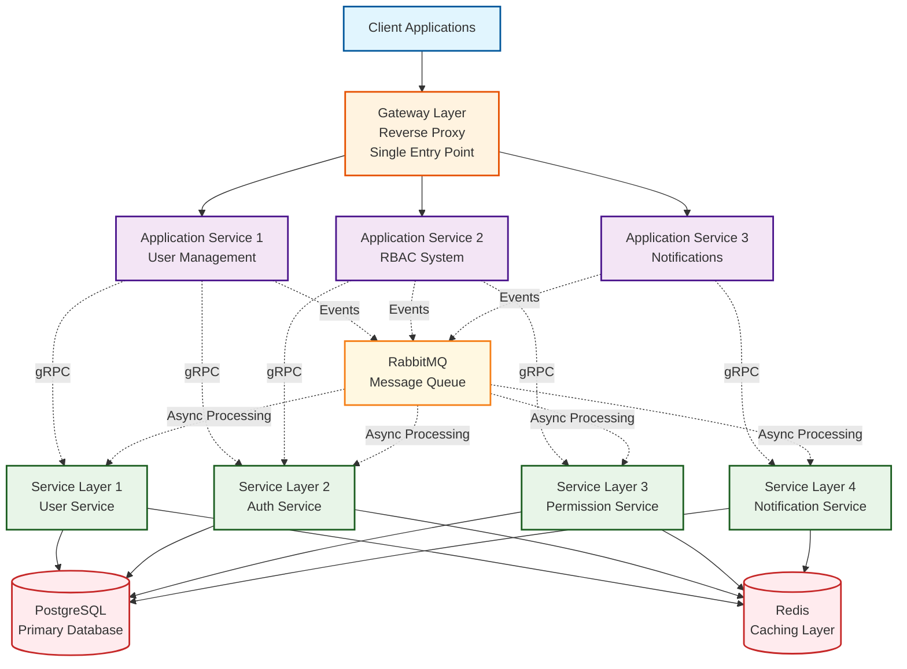

# Microservices Architecture Diagram

This diagram illustrates the layered architecture and communication patterns of the microservices backend system.

## Architecture Components

### Communication Patterns

1. **Synchronous Communication (Solid Lines)**
   - Client → Gateway: HTTP requests
   - Gateway → Application Services: HTTP routing
   - Application Services → Service Layer: gRPC calls
   - Service Layer → Database: Direct database connections
   - Service Layer → Redis: Cache operations

2. **Asynchronous Communication (Dotted Lines)**
   - Application Services → RabbitMQ: Event publishing
   - RabbitMQ → Service Layer: Event consumption and processing

### Layer Responsibilities

- **Gateway Layer**: Single entry point, request routing, load balancing
- **Application Service Layer**: Business logic orchestration, client-facing APIs
- **Service Layer**: Core business services, data access, reusable components
- **Database Layer**: Data persistence and retrieval
- **Caching Layer**: Performance optimization and session management
- **Message Queue Layer**: Event-driven processing and service decoupling
